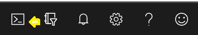

# Tagged Template Translation tool.

This tool enables you to add i18n/translations to your TypeScript application without having to 
rely on *any* third party libraries. 

> **New!**: If you don't want to use automatic translation use `--no-translate` and it will not use the Azure Translator service and you won't have to sign up for an account. You can manually update the translations. 

## How Does It Work?

By using [tagged templates](https://developer.mozilla.org/en-US/docs/Web/JavaScript/Reference/Template_literals#tagged_templates) (ie ``console.log(i`Two plus five is: ${2+5}`)``) you can mark your strings that you want to support translation for.
A tiny bit of code (see below) needs to be added to your project to supply the functions for the translator (`i`) and the code to set the locale (`setLocale`).

Then this tool can be used to generate translations for all those strings. Other than using the template translator prefix (``i`some text` ``), you do not need to change your strings or templates in order to use this.

The translator uses the [Azure Translator](https://azure.microsoft.com/en-us/services/cognitive-services/translator/) service (you can get a free Azure account, and do up to 2 million characters translation per month for free) service to generate language files.

The generated language files are each a TypeScript file that handles the translation and still supports value substitution. Even nested templates should work just fine. 

If you don't like the automated translation, you can easily replace the translation with whatever you want, rerunning the tool won't overwrite your changes.


## How To/Example

#### Prerequisites:
1. Install the tool as a dev-dependency: `npm install TaggedTemplateTranslator --save-dev`
2. Create an Azure Account (free) and create a Translator resource and then go to the [portal](https://portal.azure.com) and open the cloud shell (top right of the window)



You can choose bash or powershell. The bash commands are:

``` bash
 # create a resource group 'MyResourceGroup'
> az group create --resource-group MyResourceGroup --location westus

 # create a free translator resource 'MyTranslator'
> az cognitiveservices account create --kind TextTranslation --name MyTranslator  --resource-group MyResourceGroup --sku F0 --location global

 # get your API key 
> az cognitiveservices account keys list --name MyTranslator  --resource-group MyResourceGroup

 {
  "key1": "################################",
  "key2": "################################"
 }

```
Copy either key, and when you need to use the translate tool, either set an environment variable `translator_key` or use `--key=################` on the command line 

#### Instructions 

You need to add the following code to your project:

> i18n.ts 
``` typescript
import { join } from 'path';

/** what a language map looks like. */
interface language {
  [key: string]: (...args: Array<any>) => string;
}

type PrimitiveValue = string | number | boolean | undefined | Date;

let translatorModule: language | undefined = undefined;

export function setLocale(newLocale: string, basePath?: string) {
  try {
    // eslint-disable-next-line @typescript-eslint/no-var-requires
    translatorModule = <language>(require(join(basePath || `${__dirname}/../i18n`, newLocale.toLowerCase())).map);
  } catch {
    // translation did not load.
    // let's try to trim the locale and see if it fits
    const l = newLocale.lastIndexOf('-');
    if (l > -1) {
      setLocale(newLocale.substr(0, l), basePath);
    }
    // fallback to no translation
    translatorModule = undefined;
  }
}

/**
 * processes a TaggedTemplateLiteral to return either:
 * - a template string with numbered placeholders
 * - or to resolve the template with the values given.
 *
 * @param literals The templateStringsArray from the templateFunction
 * @param values the values from the template Function
 * @param formatter an optional formatter (formats to ${##} if not specified)
 */
function normalize(literals: TemplateStringsArray, values: Array<PrimitiveValue>, formatter?: (value: PrimitiveValue) => string) {
  const content = formatter ? literals.flatMap((k, i) => [k, formatter(values[i])]) : literals.flatMap((k, i) => [k, `$\{${i}}`]);
  content.length--; // drop the trailing undefined.
  return content.join('');
}

/**
 * Support for tagged template literals for i18n.
 *
 * Leverages translation files in ../i18n
 *
 * @param literals the literal values in the tagged template
 * @param values the inserted values in the template
 *
 * @translator
 */
export function i(literals: TemplateStringsArray, ...values: Array<string | number | boolean | undefined | Date>) {
  // if the language has no translation, use the default content.
  if (!translatorModule) {
    return normalize(literals, values, (content) => `${content}`);
  }
  // use the translator module, but fallback to no translation if the file doesn't have a translation.
  const fn = translatorModule[normalize(literals, values)];
  return fn ? fn(...values) : normalize(literals, values, (content) => `${content}`);
}

```

Then, in all your source files where you need translations, import the translator function

``` typescript
import { i } from './i18n';

```

and then instead of using double-quotes or single-quotes for strings, use the `i` tagged template prefix for backtick strings:

``` typescript
const weight = 100;
console.log( i`Mary had a little lamb` );
console.log( i`it was ${weight} kilograms` )

```

Any time you want to update/generate your translations, run the tool on the project: 

``` bash
./node-modules/.bin/translate-strings .
```

You could add `"update-translations": "translate-strings ."` to your npm scripts block, and use `npm run update-translations` anytime. 

When you want to add a new language translation, use `--add-language=` (can specify multiple times)

``` bash
# add german and italian
translate-strings /path/to/project --add-language=de --add-language=it
```
# Command Line Reference 

The command is: 

`translate-strings <project folder> <switches>`

possible switches

|switch|description|
|--|--|
| `--key=<####>` | specify the Azure Translate key on the command line. Or use and environment variable `translator_key` | 
| `--output=<folder>` | specify the folder where the translation files are generated. defaults to `<project-folder>/i18n/`
| `--add-language=<code>` | add a new translation file for the language with the given code. | 
| `--no-translate` | Skips doing translation, but will fill in language files with todo notes instead |


### Current language codes:

You can get the latest language codes by executing the following at the command line:

``` bash
node -e 'require(`https`).get(`https://api.cognitive.microsofttranslator.com/languages?api-version=3.0`, (response) => { let buf = Buffer.alloc(0); response.on(`data`, (data) => { buf = Buffer.concat([buf, data]); }); response.on(`end`, () => { let t = JSON.parse(buf.toString(`utf-8`)); console.log(Object.keys(t.translation).map(k => `${k} => ${t.translation[k].name}`).join(`\n`)); }); });'
```

Which will print something like:   
```
af => Afrikaans
ar => Arabic
as => Assamese
bg => Bulgarian
bn => Bangla
bs => Bosnian
ca => Catalan
cs => Czech
cy => Welsh
da => Danish
de => German
el => Greek
en => English
es => Spanish
et => Estonian
fa => Persian
fi => Finnish
fil => Filipino
fj => Fijian
fr => French
fr-ca => French (Canada)
ga => Irish
gu => Gujarati
he => Hebrew
hi => Hindi
hr => Croatian
ht => Haitian Creole
hu => Hungarian
id => Indonesian
is => Icelandic
it => Italian
iu => Inuktitut
ja => Japanese
kk => Kazakh
kmr => Kurdish (Northern)
kn => Kannada
ko => Korean
ku => Kurdish (Central)
lt => Lithuanian
lv => Latvian
mg => Malagasy
mi => Maori
ml => Malayalam
mr => Marathi
ms => Malay
mt => Maltese
mww => Hmong Daw
nb => Norwegian
nl => Dutch
or => Odia
otq => Querétaro Otomi
pa => Punjabi
pl => Polish
prs => Dari
ps => Pashto
pt => Portuguese (Brazil)
pt-pt => Portuguese (Portugal)
ro => Romanian
ru => Russian
sk => Slovak
sl => Slovenian
sm => Samoan
sr-Cyrl => Serbian (Cyrillic)
sr-Latn => Serbian (Latin)
sv => Swedish
sw => Swahili
ta => Tamil
te => Telugu
th => Thai
tlh-Latn => Klingon (Latin)
tlh-Piqd => Klingon (pIqaD)
to => Tongan
tr => Turkish
ty => Tahitian
uk => Ukrainian
ur => Urdu
vi => Vietnamese
yua => Yucatec Maya
yue => Cantonese (Traditional)
zh-Hans => Chinese Simplified
zh-Hant => Chinese Traditional
```

# Contributing
This project welcomes contributions and suggestions.  Most contributions require you to agree to a
Contributor License Agreement (CLA) declaring that you have the right to, and actually do, grant us
the rights to use your contribution. For details, visit https://cla.microsoft.com.

When you submit a pull request, a CLA-bot will automatically determine whether you need to provide
a CLA and decorate the PR appropriately (e.g., label, comment). Simply follow the instructions
provided by the bot. You will only need to do this once across all repos using our CLA.

This project has adopted the [Microsoft Open Source Code of Conduct](https://opensource.microsoft.com/codeofconduct/).
For more information see the [Code of Conduct FAQ](https://opensource.microsoft.com/codeofconduct/faq/) or
contact [opencode@microsoft.com](mailto:opencode@microsoft.com) with any additional questions or comments.

